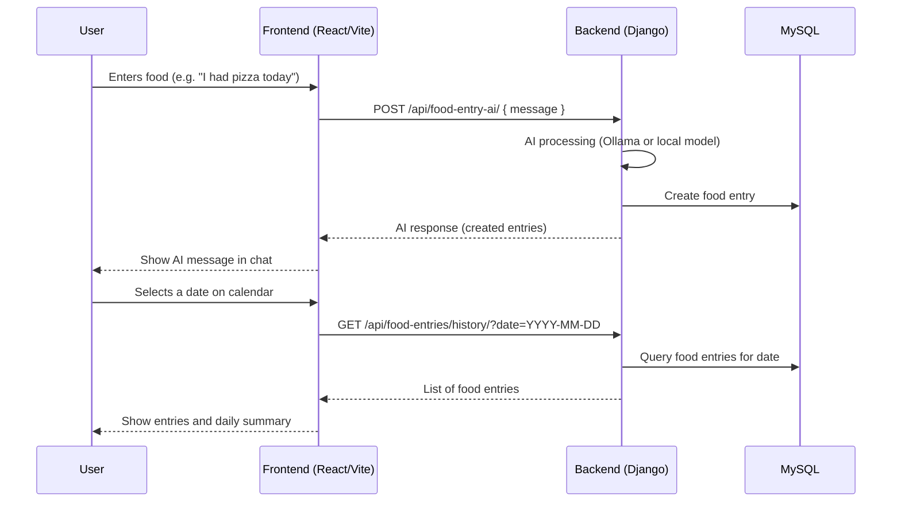

## Prerequisites

- [Docker](https://www.docker.com/get-started) and [Docker Compose](https://docs.docker.com/compose/)
- (For local dev) Node.js (v18+) and Python (3.10+)

---

## Quick Start (Docker)

1. **Clone the repository:**

   ```sh
   git clone <your-repo-url>
   cd ai_health_coach
   ```

2. **Create a `.env` file in the project root:**

   ```env
   MYSQL_DATABASE=health_coach_db
   MYSQL_USER=healthuser
   MYSQL_PASSWORD=healthpass
   MYSQL_ROOT_PASSWORD=rootpass

   DJANGO_SECRET_KEY=your-secret-key
   DJANGO_DEBUG=True
   DJANGO_ALLOWED_HOSTS=*

   DB_NAME=health_coach_db
   DB_USER=healthuser
   DB_PASSWORD=healthpass
   DB_HOST=db
   DB_PORT=3306

   VITE_API_BASE_URL=http://backend:8000
   ```

3. **Build and start all services:**

   ```sh
   docker-compose up --build
   ```

4. **Apply Django migrations:**

   ```sh
   docker-compose exec backend python manage.py migrate
   ```

5. **(Optional) Create a Django superuser:**

   ```sh
   docker-compose exec backend python manage.py createsuperuser
   ```

6. **Access the app:**
   - Frontend: [http://localhost:5173](http://localhost:5173)
   - Backend API: [http://localhost:8000](http://localhost:8000)
   - MySQL: localhost:3306 (use credentials from `.env`)

---

## Local Development (Without Docker)

### Backend

1. **Install Python dependencies:**

   ```sh
   cd server
   python -m venv venv
   source venv/bin/activate  # or venv\Scripts\activate on Windows
   pip install -r requirements.txt
   ```

2. **Configure your database in `server/health_coach/health_coach/settings.py`.**

3. **Run migrations and start the server:**
   ```sh
   python manage.py migrate
   python manage.py runserver
   ```

### Frontend

1. **Install Node dependencies:**

   ```sh
   cd client
   npm install
   ```

2. **Set API base URL in `.env` (in `client/`):**

   ```
   VITE_API_BASE_URL=http://localhost:8000
   ```

3. **Start the dev server:**
   ```sh
   npm run dev
   ```

---

## Environment Variables

- All environment variables for Docker Compose are set in the root `.env` file.
- For local frontend dev, set `VITE_API_BASE_URL` in `client/.env`.

---

## API Endpoints

- **Check Ollama:** `GET /api/check-ollama/`
- **Check Model:** `GET /api/check-model/`
- **Food Entries:** `GET/POST /api/food-entries/`
- **Food Entry AI:** `POST /api/food-entry-ai/`
- **Health Insight:** `POST /api/health-insight/`
- ...and more (see Django REST API code for details)

---

## Sequence Diagram



---

## Useful Commands

- **Stop all containers:**  
  `docker-compose down`
- **Rebuild after code changes:**  
  `docker-compose up --build`
- **View logs:**  
  `docker-compose logs -f`

---

## Troubleshooting

- If you see MySQL connection errors, ensure the database service is healthy and Django is using the correct credentials.
- If the frontend cannot reach the backend, check that `VITE_API_BASE_URL` is set correctly and both services are running.

---

---

## Ollama Service Detection & Docker Networking

### Overview

This project uses [Ollama](https://ollama.com/) as a local AI model backend. The Django backend checks if Ollama is running by making a network request to its API endpoint, rather than checking for a local binary. This approach is robust and works seamlessly in Dockerized environments.

### How It Works

- The backend checks if Ollama is running by sending a GET request to:

  ```
  http://localhost:11434/
  ```

  If the response contains `Ollama is running`, the service is considered available.

- The backend also checks if the required model (e.g., `gemma2:2b`) is available by querying:
  ```
  http://localhost:11434/api/tags
  ```

### Docker Networking

- When running in Docker, the backend container cannot access `localhost` on your host machine directly.
- We use the special DNS name `host.docker.internal` to allow the container to reach services running on the host.
- This is set via the environment variable in `docker-compose.yml`:
  ```yaml
  environment:
    - OLLAMA_HOST=host.docker.internal
  ```
- The backend code uses this variable to construct the correct API URL.

### Environment Variables

| Variable    | Description                               | Default   |
| ----------- | ----------------------------------------- | --------- |
| OLLAMA_HOST | Hostname for Ollama API (Docker: special) | localhost |

### Example: How the Check Works

```python
import os
import requests

OLLAMA_HOST = os.environ.get("OLLAMA_HOST", "localhost")
OLLAMA_BASE_URL = f"http://{OLLAMA_HOST}:11434"

def check_ollama_service_running():
    try:
        response = requests.get(OLLAMA_BASE_URL, timeout=3)
        return response.status_code == 200 and "Ollama is running" in response.text
    except requests.exceptions.RequestException:
        return False
```

### Troubleshooting

- **Ollama not detected in Docker?**
  - Make sure Ollama is running on your host machine.
  - Ensure `OLLAMA_HOST=host.docker.internal` is set in your backend service environment.
  - Restart your containers after changing environment variables.

---

## License

MIT

---

## Contributors

- Christopher Castro

---
